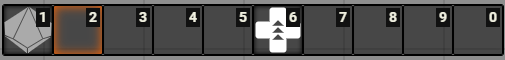
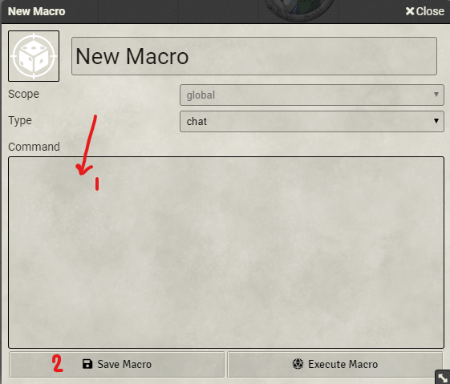
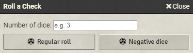
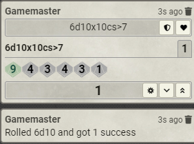

# WoD-dice-roller
A Foundry VTT Macro for World of Darkness

## How to Use

### Create a Macro
In Foundry, click an empty slot on your hotbar at the bottom of the screen to bring up the New Macro dialog

### Paste the Code
Change the name if you'd like, **make sure you change the type from 'chat' to 'script'** and paste the code from the 'script.js' file in here (1) and click 'Save Macro' (2)

### Use the Macro
Now you can just click the button on your hotbar to use the macro! Input a number of dice to roll, and the macro will roll the dice for you.

10s will automatically explode (roll again), and the macro will count the number of successes (8, 9, or 10).

Or, if you click 'negative dice' you'll roll only one d10, will not explode, and will only count a 10 as a success.
